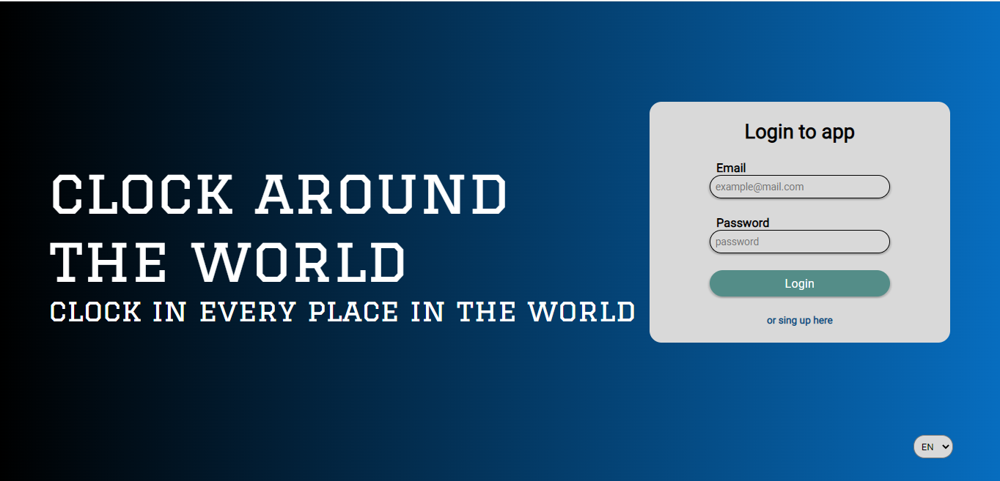
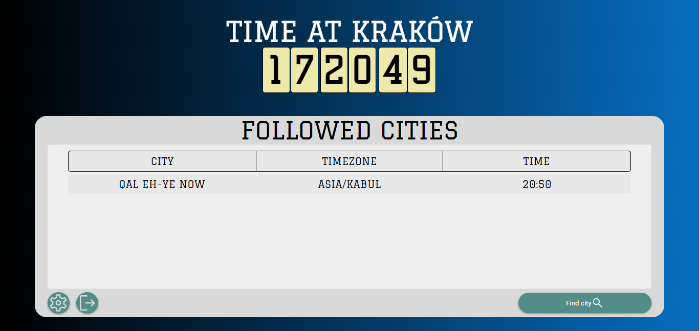
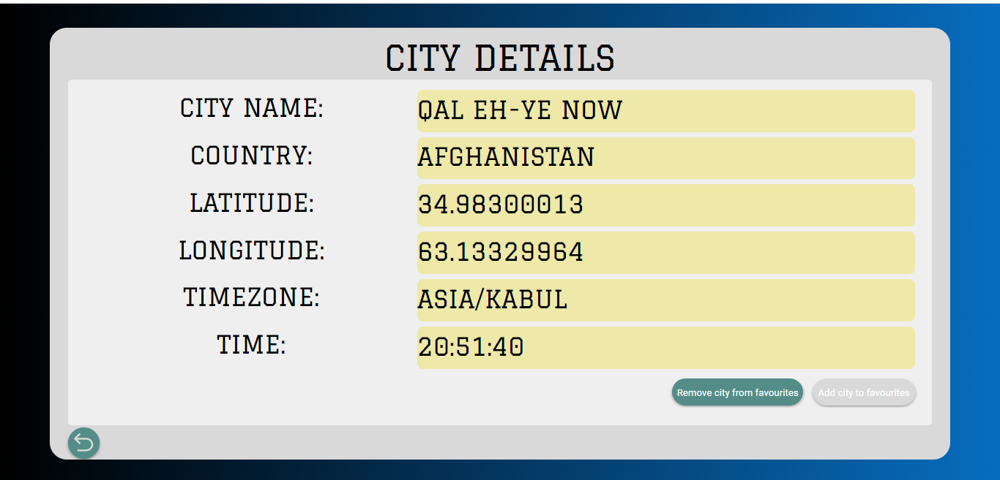

# clock-around-world

## Table of Contents
* [General Info](#general-information)
* [Technologies Used](#technologies-used)
* [Features](#features)
* [Screenshots](#screenshots)
* [Usage](#usage)
* [Project Status](#project-status)
* [Contact](#contact)

## General Information
- Project allow users to login or register to app and then they can follow cities which they want to know actual time
Users can search for cities by city name with similar cities name or by providing full country name. For example it can be user by people working 
in different location which want to synchronise their time.

## Technologies Used
- JS ES6
- PHP - version 8.1.11
- Docker - version 3.8
- Postrgesql - version 15.1
- CSS3
- HTML5 

## Features
List the ready features here:
- Displaying time in current location
- Displaying time in followed location
- Displaying time in selected location
- Login in app
- Regitster in app
- Password/Email changing
- Admin: Can delete user and see their activity

## Screenshots

.

## Usage
- Register to app
- Login with your account
- Search for city you want followe
- Add city to followed
- See city in dashboard

## Project Status
Project is: _in progress_ 

## Contact
Created by Tomasz Stolarz - feel free to contact me!

